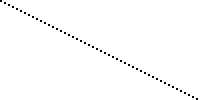
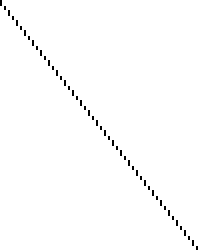
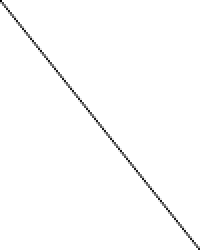
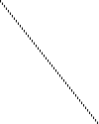

Smoothmotion
============

Many people have come to misunderstand the functionality and purpose of
smoothmotion, going as far as confusing it with motion interpolation (such as
found in SVP or MVTools).



To demonstrate the difference, we will look at what happens when trying to
display a 24 Hz video file on 60 Hz monitor. This is the source file I will be
using. For illustration, each video frame will appear as one horizontal line of
the image. (So the vertical axis is the time axis)

We will now discuss different techniques of converting this to a 60 Hz video
stream (suitable for display on a 60 Hz monitor, for example). As a result, the
vertical axis will be rescaled from 100 pixels to 250 pixels. (60/24 = 2.5)

3:2 pulldown
============



The traditional technique, including the default mpv behavior, is to simply
hold each source frame until the corresponding timestamp of the next frame has
passed. Due to the particular ratio in this example (24/60 = 0.4), it means
that the first frame will be shown 3 times, the second frame 2 times, the third
3 times, the fourth 2 times and so on. The pattern looks like this:

```A A A B B C C C D D E E E F F```

As can be clearly seen, the inconsistent width results in a jagged appearance,
which is a visualization of the phenomenon known as judder.

Motion interpolation
====================



True motion interpolation algorithms like SVP, MVTools or the chips built into
various TV devices employ complex algorithms to try and recognize movement in
the video, and fill in the missing gaps as needed.

This drastically alters the result - it's now one continuous motion, similar
to a true 60 Hz clip. However, this comes at a cost - not only are the
mathematics involved extremely expensive to compute, but the algorithms also
aren't perfect, and often result in artifacts (deformed images, wavy lines,
etc.).

Furthermore, this is the source of the so-called soap opera effect, which is
simply referring to what 60 Hz motion looks like. The name is based on the
fact that cheap TV programs like soap operas are often filmed at interlaced 60
Hz rather than the (more expensive) film format that most cinematic content
uses, which is usually shot at 24 Hz. Many people therefore subconsciously
associate the visual appearance of 60 Hz content with soap operas, and thus
think it looks worse.

Smoothmotion
============



The smoothmotion approach is to display each frame exactly 2.5 times, where we
display frames for 0.5 times by blending two adjacent frames together. In terms
of the pattern, it results in something like this:

```A A A+B B B C C C+D D D E E E+F F F```

Here, A+B refers to a frame that is exactly half of A and half of B, blended
together. The overall result is that each frame is displayed for a consistent
amount of time, resulting in smooth motion.

As you can see, the overall appearance is smoother due to the increased
regularity of the frame heights, and the overall perceived framerate (24 Hz)
has not been affected - the lines are still clearly distinct.

This is not only easy to calculate (no motion-based prediction whatsoever, just
a simple blending operation of two frames), but also preserves the perceived
framerate of the original clip, so there's no soap opera effect or similar.
